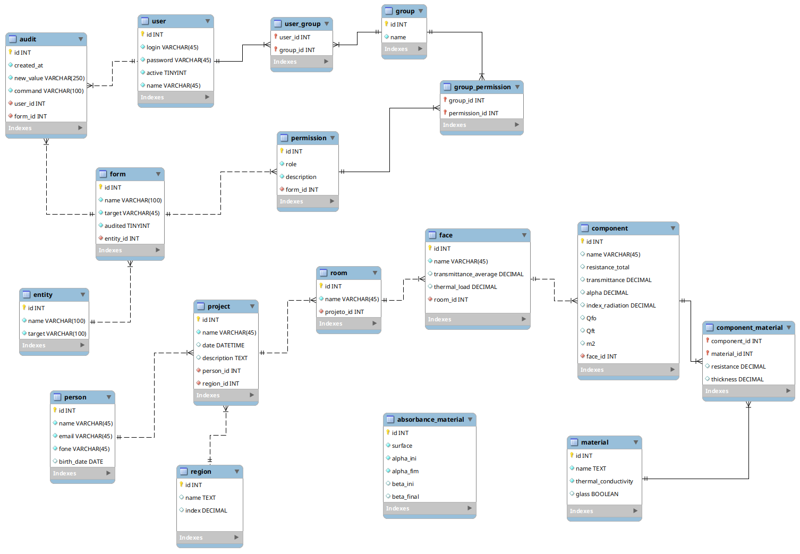

# Integrator Project 1

Project developed during the semester for the Integrator Project 1 course, Software Engineering and Information System course together with the comfort students 2 of the Architecture and Urbanism course. 
The purpose of the software is to manage a project, where it must calculate the thermal load, heat flux, and thermal resistance of the materials used by the face and environment.

### Functional Requirements:
**1.** Keep the user register.

**2.** Keep the register of  materials and thermal capacity.

**3.** Keep the register of the absorbance table of the materials.

**4.** Keep the project register.

**5.** Keep the register of rooms that belong to the project.

**6.** The system shall calculate the thermal resistance of the single-sided material set.

**7.** Keep the register of faces of each room.

**8.** The system should be able to dynamically inform how many materialities each face has.

**9.** The system shall store the sum of the thermal resistance of all materials and components on the same face.

**10.** Material thickness should be calculated in meters.

**11.** The system shall be able to dynamically inform the internal temperature and the external temperature.

**12.** The system shall be able to dynamically inform the thermal transmittance and solar factor for the glass materiality.

**13.** The system shall calculate heat flow for winter and summer for various face components according to materials.

**14.** The system shall calculate the thermal transmittance of each face component.

**15.** The system shall calculate the thermal load of the face.

**16.** At the end of the calculation the system shall convert the power consumption from Watts to BTUS.

**17.** The system should send emails with attachments.

**18.** The system shall have a dashboard with data.

### Nonfunctional Requirements:
**1.** The system must be desktop.

**2.** Use Java programming language.

**3.** Use in building JavaFX, CSS screens.

**4.** Use the Spring boot framework.

**5.** Use PostgreSQL database.

**6.** Perform access control by login and password.

**7.** Perform access permission control by user type.

**8.** The system must perform password encryption.

**9.** The system shall allow for data audit by modules.

**10.** The system shall enable data auditing to be disabled.

**11.** The system should generate error logs.

**12.** The system must use a library for sending emails.

### Technologies 
  * Java: 1.8
  * JavaFX: 2.2
  * Spring boot, Spring Data JPA: 2.1.3
  * Lombok: 1.18.6
  * PostgreSQL: 42.2
  * Flyway: 5.2.4
  * JFoenix : 8.0.9
  * ContolsFX: 8.40.15
  
### Demonstration

### ER Model

### Use case

